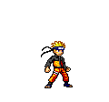

<h1 align="center">
    
</h1>

    <h3 style="position: relative; right: -20px;">
         Avidly learning and growing
        
    </h3>

🔥 I'm dedicating time to level up myself 🔥

🌱 And diving into **TypeScript, Docker,** and more right now! 🌊

✨ Crafting digital magic 🪄, turning caffeine ☕️ into clean & powerful code </>

🪄 Fun fact: The first computer bug 🐛 was an actual bug, a moth 🦋 found in a Harvard Mark II computer in 1947, which caused a malfunction. This is how the term "debugging" originated!

💬 Curious about **Python 🐍, React...** or anything else? Ask away [here](https://github.com/kshuxx/kshuxx/issues)! 📨

<h2 align="center">
    Languages-Frameworks & Tools
</h2>
 

    
     

  <h2>🍎 Git Gourmet 🍏</h2>
  

<h2 align="center" style="position: relative; left: -20px;">
    
    Code 次元 (Jigen)
</h2>
 

    
    
     
    

 

